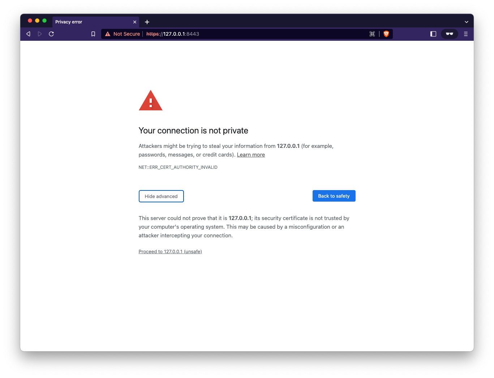
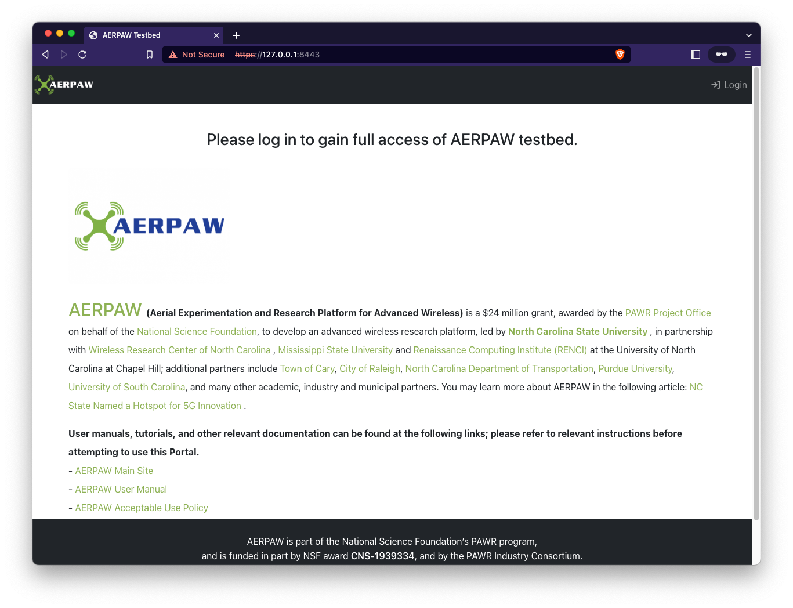

# Deploy

You must update your local configuration files prior to using Deploy (see [Configure](./configure.md))

**Note**: Depending on your version of docker you may need to run Docker Compose with or without the `-` hyphen

- with: `docker-compose ...`
- without: `docker compose ...` (documentation uses this version)

## Choose your mode of operation

The portal can be run in three different modes depending on your use case

1. [Local Development - HTTP](#local-dev) (`local-dev`)
2. [Local Development - with SSL](#local-ssl) (`local-ssl`)
3. [Production - all in Docker](#in-docker) (`docker`)

## 1. <a name="local-dev"></a>Local Development - HTTP

### Start at the main level of the repository

Load the environment variables into the shell

```console
cd aerpaw-portal
source .env
```

### Python virtual environment

Create the python virtual environment and install the required packages

```console
virtualenv -p /usr/local/bin/python3 venv
source venv/bin/activate
pip install -r requirements.txt
```

**NOTE**: `-p /usr/local/bin/python3` - is the local path to the Python3 installation on my laptop and may be different on your platform

### Bring up the database in docker

Update local docker images and start the database container

```console
docker compose pull
docker compose up -d
```

### Run the server application locally

The first time the server is run you will want to make database migration files and load existing database fixtures

- `--run-mode local-dev` - runs the local Django development server
- `--make-migrations` - generates the migration files that link the Django models to the Postgres database
- `--load-fixures` - will load any fixture files found in the `portal/apps/users/fixtures` directory (only `aerpaw_roles.json` is present by default)


```console
./run_server.sh --run-mode local-dev --load-fixtures --make-migrations
```

At this point you should have a running portal at: [http://127.0.0.1:8000/]()


The newly deployed portal will not have any Users, Resources, etc. 

If this the first time you've deployed the portal see [First Run](./first-run.md)

## 2. <a name="local-ssl"></a>Local Development - with SSL

### Start at the main level of the repository

Load the environment variables into the shell

```console
cd aerpaw-portal
source .env
```

### Python virtual environment

Create the python virtual environment and install the required packages

```console
virtualenv -p /usr/local/bin/python3 venv
source venv/bin/activate
pip install -r requirements.txt
```

**NOTE**: `-p /usr/local/bin/python3` - is the local path to the Python3 installation on my laptop and may be different on your platform

### Bring up the database and nginx in docker

Update local docker images and start the database container

```console
docker compose pull
docker compose up -d
```

verify that the database and nginx are running

```console
$ docker compose ps
NAME                COMMAND                  SERVICE             STATUS              PORTS
portal-database     "docker-entrypoint.s…"   database            running             0.0.0.0:5432->5432/tcp, :::5432->5432/tcp
portal-nginx        "/docker-entrypoint.…"   nginx               running             0.0.0.0:8080->80/tcp, :::8080->80/tcp, 0.0.0.0:8443->443/tcp, :::8443->443/tcp
```

### Run the server application locally

The first time the server is run you will want to make database migration files and load existing database fixtures

- `--run-mode local-ssl` - runs Django locally using uWSGI as the server
- `--make-migrations` - generates the migration files that link the Django models to the Postgres database
- `--load-fixures` - will load any fixture files found in the `portal/apps/users/fixtures` directory (only `aerpaw_roles.json` is present by default)

```console
UWSGI_UID=$(id -u) UWSGI_GID=$(id -g) ./run_server.sh --run-mode local-ssl --load-fixtures --make-migrations
```

At this point you should have a running portal at: [https://127.0.0.1:8443/]() or you can access it from [http://127.0.0.1:8080/]() which will automatically redirect to the HTTPS page due to Nginx

The first time you access the site you will see a warning regarding an untrusted SSL certificate, this is expected due to it being self-signed



Accept the risks and proceed to the portal main page



The newly deployed portal will not have any Users, Resources, etc. 

If this the first time you've deployed the portal see [First Run](./first-run.md)

## 3. <a name="in-docker"></a>Production - all in Docker

### Start at the main level of the repository

Load the environment variables into the shell

```console
cd aerpaw-portal
```

Because the Portal application stack is run entirely in Docker you will not need to import any environment variables or run application code on your local host.

### Bring up the database, nginx and django in docker

Update local docker images and start the database container

```console
docker compose pull
```

Build the django Docker image

```console
docker compose build
```

Start the containers - this will take some time when first run as all the Python packages will need to be installed onto the django container

The first time the server is run you will want to make database migration files and load existing database fixtures

- `MAKE_MIGRATIONS=1` - generates the migration files that link the Django models to the Postgres database
- `LOAD_FIXTURES=1` - will load any fixture files found in the `portal/apps/users/fixtures` directory (only `aerpaw_roles.json` is present by default)

```console
MAKE_MIGRATIONS=1 LOAD_FIXTURES=1 docker compose up -d
```

verify that the database, django and nginx containers are running - note that only the Nginx ports are exposed through the host

```console
$ docker compose ps
NAME                COMMAND                  SERVICE             STATUS              PORTS
portal-database     "docker-entrypoint.s…"   database            running             5432/tcp
portal-django       "/code/docker-entryp…"   django              running
portal-nginx        "/docker-entrypoint.…"   nginx               running             0.0.0.0:8080->80/tcp, :::8080->80/tcp, 0.0.0.0:8443->443/tcp, :::8443->443/tcp
```

At this point you should have a running portal at: [https://127.0.0.1:8443/]() or you can access it from [http://127.0.0.1:8080/]() which will automatically redirect to the HTTPS page due to Nginx

The first time you access the site you will see a warning regarding an untrusted SSL certificate, this is expected due to it being self-signed


Accept the risks and proceed to the portal main page


The newly deployed portal will not have any Users, Resources, etc. 

If this the first time you've deployed the portal see [First Run](./first-run.md)
