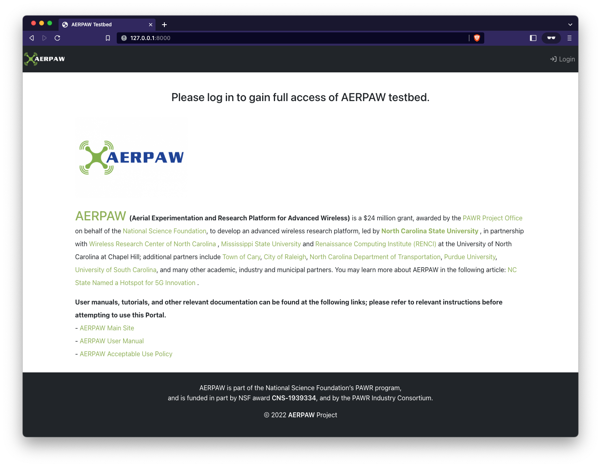

# Deploy

You must update your local configuration files prior to using Deploy (see [Configure](./configure.md))

**Note**: Depending on your version of docker you may need to run Docker Compose with or without the `-` hyphen

- with: `docker-compose ...`
- without: `docker compose ...` (documentation uses this version)

## Choose your mode of operation

The portal can be run in three different modes depending on your use case

1. [Local Development - HTTP](#local-dev)
2. [Local Development - with SSL](#local-ssl)
3. [Production - all in Docker](#in-docker)

## 1. <a name="local-dev"></a>Local Development - HTTP

### Start at the main level of the repository

Load the environment variables into the shell

```console
cd aerpaw-portal
source .env
```

### Python virtual environment

Create the python virtual environment and install the required packages

```console
virtualenv -p /usr/local/bin/python3 venv
source venv/bin/activate
pip install -r requirements.txt
```

**NOTE**: `-p /usr/local/bin/python3` - is the local path to the Python3 installation on my laptop and may be different on your platform

### Bring up the database in docker

Update local docker images and start the database container

```console
docker compose pull
docker compose up -d
```

### Run the server application locally

The first time the server is run you will want to make database migration files and load existing database fixures


```console
./run_server.sh --run-mode local-dev --load-fixtures --make-migrations
```

At this point you should have a running portal at: [http://127.0.0.1:8000/]()



The newly deployed portal will not have any Users, Resources, etc. 

## 2. <a name="local-ssl"></a>Local Development - with SSL

### Start at the main level of the repository

Load the environment variables into the shell

```console
cd aerpaw-portal
source .env
```

### Python virtual environment

Create the python virtual environment and install the required packages

```console
virtualenv -p /usr/local/bin/python3 venv
source venv/bin/activate
pip install -r requirements.txt
```

**NOTE**: `-p /usr/local/bin/python3` - is the local path to the Python3 installation on my laptop and may be different on your platform

### Bring up the database and nginx in docker

Update local docker images and start the database container

```console
docker compose pull
docker compose up -d
```

verify that the database is running

```console
$ docker compose ps
NAME                COMMAND                  SERVICE             STATUS              PORTS
portal-database     "docker-entrypoint.s…"   database            running             0.0.0.0:5432->5432/tcp, :::5432->5432/tcp
```

### Run the server application locally

The first time the server is run you will want to make database migration files and load existing database fixures


```console
./run_server.sh --run-mode local-dev --load-fixtures --make-migrations
```


## 3. <a name="in-docker"></a>Production - all in Docker
