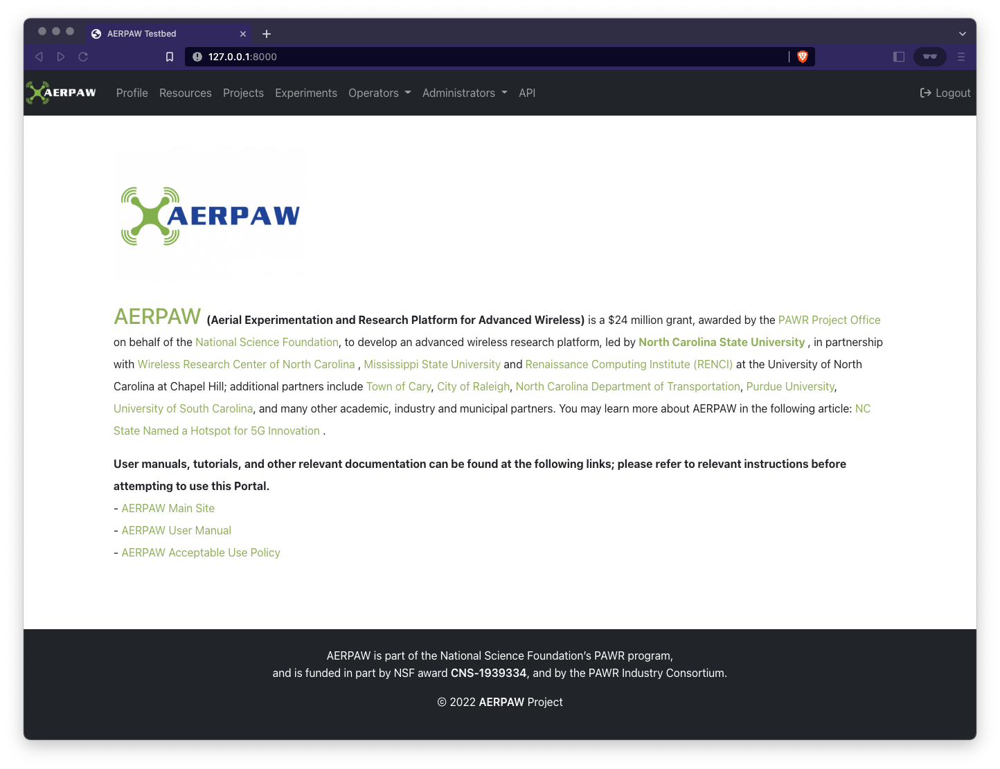

# First Run

When the portal is deployed for the first time it will have no Users, Resources, or anything else to speak of. The first action on a new portal should be to create the initial administrative user.

Example using local-dev portal running at: [http://127.0.0.1:8000/admin/]()


## Initial Administrative User

The username and password for the initial administrative user will be picked up from the `.env` settings

```env
EMAIL_ADMIN_USER='demo_admin@gmail.com'
AERPAW_OPS_PORTAL_PASSWORD='xxxxxxxxxx'
```

Run the management`create_aerpaw_admin_user` command to create the initial administrator. How to run the command differs slightly depending on the run mode being used.

### Local Development

```console
python -m manage create_aerpaw_admin_user
```
**Note**: the warning about `'MyOIDCAB' object has no attribute 'request'` is expected

### In Docker

```console
docker exec portal-django /usr/bin/env bash -c "source .env; source .venv/bin/activate; python -m manage create_aerpaw_admin_user"
```
**Note**: the warning about `'MyOIDCAB' object has no attribute 'request'` is expected

### Setting Administrator roles

Navigate to the admin page at: [http://127.0.0.1:8000/admin/]() and login using the username and password from above


After logging in you will see the user information in the "Aerpaw users" section


Update the user with the Groups needed (generally this is all of them) and save.


Navigating back to the main portal page will now show the full navigation bar for use by the initial administrative user



Back to [README](../README.md)

