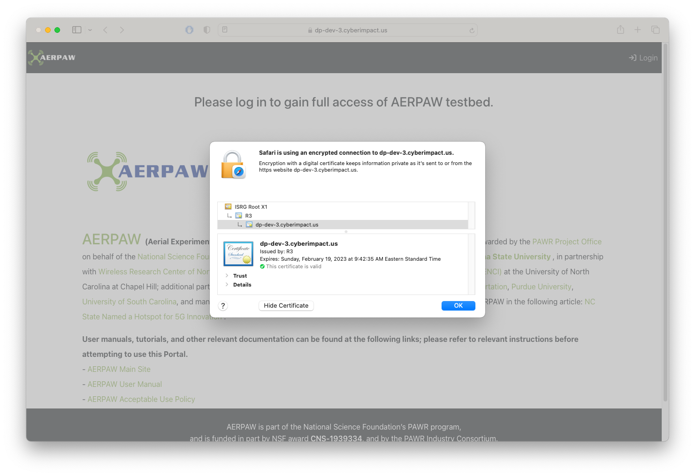

# Production Overview

You will require a server where you have root or sudo level access to deploy the components needed to operate/administrate the AERPAW Portal

## Preparatory steps

### Server with registered domain name

You will need a server that has a registered domain name such that users and services can reach it to interact with the Portal and API

Example: [dp-dev-3.cyberimpact.us]() will be used for documentation purposes

```console
$ ping -c 3 dp-dev-3.cyberimpact.us
PING dp-dev-3.cyberimpact.us (152.54.2.147): 56 data bytes
64 bytes from 152.54.2.147: icmp_seq=0 ttl=62 time=0.514 ms
64 bytes from 152.54.2.147: icmp_seq=1 ttl=62 time=0.670 ms
64 bytes from 152.54.2.147: icmp_seq=2 ttl=62 time=0.715 ms

--- dp-dev-3.cyberimpact.us ping statistics ---
3 packets transmitted, 3 packets received, 0.0% packet loss
round-trip min/avg/max/stddev = 0.514/0.633/0.715/0.086 ms
```

### Service account

Ideally services should be run as a service account with Docker rights, and not as a particular individual. For this example the `nrig-service` account will be used

Example:

```console
$ id nrig-service
uid=20049(nrig-service) gid=10000(service accounts) groups=10000(service accounts),991(docker)
```

### CILogon OIDC RP

You will need to register your server with [CILogon](https://www.cilogon.org/oidc) to obtain an OIDC Client ID / Secret pair

Example Client ID / Secret pair:

```
Client ID:     cilogon:/client_id/712e00a67d90993328bc349fde638fe1
Client Secret: 3cVmyj7WlCPbDIYbNG4KdURAXxeXij8mKHXECLV_HHjYBzzl0sOwhhjYyFrtuvKjAIOs_B_pgp1kHB80mBQ2yQ
```
In addition you will also need to register the callback URLs to use for your domain

Example callback URL:

- [https://dp-dev-3.cyberimpact.us/oidc/callback/]()


### Docker and Docker Compose

Ensure that both [Docker](https://docs.docker.com/engine/install/) and [Docker Compose](https://docs.docker.com/compose/) are installed on the server and available to the user that will be running the portal services

### SSL certificates

Ensure that you have trusted SSL certificates for your server so that you may run securely.

SSL certificates can be had free of charge using [Let's Encrypt](https://letsencrypt.org)

There is a script based method using Docker located here: [ez-letsencrypt](https://github.com/RENCI-NRIG/ez-letsencrypt)

**Example usage**

- user: `nrig-service` - a service account with Docker rights
- hostname: `dp-dev-3.cyberimpact.us`
- email: `michael.j.stealey@gmail.com` - my personal GitHub account
- certsdir: `/root/certs` - created ahead of time by the root user to store the SSL certificate
- webrootdir: `/home/nrig-service/acme_files` - created ahead of time by the nrig-service user to store the challenge files


Execute a dry-run:

```console
./ez_letsencrypt.sh \
  --hostname dp-dev-3.cyberimpact.us \
  --email michael.j.stealey@gmail.com \
  --certsdir /root/certs \
  --webrootdir /home/nrig-service/acme_files \
  --dryrun
```

```console
$ ./ez_letsencrypt.sh \
>   --hostname dp-dev-3.cyberimpact.us \
>   --email michael.j.stealey@gmail.com \
>   --certsdir /root/certs \
>   --webrootdir /home/nrig-service/acme_files \
>   --dryrun
Unable to find image 'certbot/certbot:latest' locally
latest: Pulling from certbot/certbot
...
f1ca4ba295b4: Pull complete
Digest: sha256:10a3c64f164a03136cfd9613812f21084b6094eaea0ce1d278f7ae3e03b17f7b
Status: Downloaded newer image for certbot/certbot:latest
Saving debug log to /var/log/letsencrypt/letsencrypt.log
Account registered.
Simulating a certificate request for dp-dev-3.cyberimpact.us
The dry run was successful.
```

If the dry run is successful, then run the script in normal mode

```console
./ez_letsencrypt.sh \
  --hostname dp-dev-3.cyberimpact.us \
  --email michael.j.stealey@gmail.com \
  --certsdir /root/certs \
  --webrootdir /home/nrig-service/acme_files
```

```console
$ ./ez_letsencrypt.sh \
>   --hostname dp-dev-3.cyberimpact.us \
>   --email michael.j.stealey@gmail.com \
>   --certsdir /root/certs \
>   --webrootdir /home/nrig-service/acme_files
Saving debug log to /var/log/letsencrypt/letsencrypt.log

- - - - - - - - - - - - - - - - - - - - - - - - - - - - - - - - - - - - - - - -
Would you be willing, once your first certificate is successfully issued, to
share your email address with the Electronic Frontier Foundation, a founding
partner of the Let's Encrypt project and the non-profit organization that
develops Certbot? We'd like to send you email about our work encrypting the web,
EFF news, campaigns, and ways to support digital freedom.
- - - - - - - - - - - - - - - - - - - - - - - - - - - - - - - - - - - - - - - -
(Y)es/(N)o: Y
Account registered.
Requesting a certificate for dp-dev-3.cyberimpact.us

Successfully received certificate.
Certificate is saved at: /etc/letsencrypt/live/dp-dev-3.cyberimpact.us/fullchain.pem
Key is saved at:         /etc/letsencrypt/live/dp-dev-3.cyberimpact.us/privkey.pem
This certificate expires on 2023-02-19.
These files will be updated when the certificate renews.

NEXT STEPS:
- The certificate will need to be renewed before it expires. Certbot can automatically renew the certificate in the background, but you may need to take steps to enable that functionality. See https://certbot.org/renewal-setup for instructions.

- - - - - - - - - - - - - - - - - - - - - - - - - - - - - - - - - - - - - - - -
If you like Certbot, please consider supporting our work by:
 * Donating to ISRG / Let's Encrypt:   https://letsencrypt.org/donate
 * Donating to EFF:                    https://eff.org/donate-le
- - - - - - - - - - - - - - - - - - - - - - - - - - - - - - - - - - - - - - - -
[INFO] Result of --checkcert
issuer= /C=US/O=Let's Encrypt/CN=R3
subject= /CN=dp-dev-3.cyberimpact.us
notBefore=Nov 21 14:42:36 2022 GMT
notAfter=Feb 19 14:42:35 2023 GMT
[INFO] Result of --pubkey
-----BEGIN PUBLIC KEY-----
MIICIjANBgkqhkiG9w0BAQEFAAOCAg8AMIICCgKCAgEAoDRB85CJpIkTBILS/hMe
Q50KEonBZeeV7GAkx8r0dVxZc0N7/XCuFV2QXmU4P7B2TlXA4LDOmWkosDXLVe/b
SS0dh3fu6sBDQsGK7GS3QRdKS15hF7xTw+8njNTz1WWwCCnl51sm+kfl9PUqJ59p
GPTsHfF52sF7YZ6Hr4BqRDNYIZUDcuEEIQqh+r5wtSoYFMbgW9/j5U6omvJQUNtV
7KBTPkp/mraaZrg+YjbeSQLZ9kWrCq/W6Fha59Af8GwsYjcvskgcGSzVpTm1poM0
l5yuutULDoIlxb4zrqeH20fVwpR/kiMCjmNK2XVp02sY/UDg0nemlqqY25zoJMiI
KisHktcEO6WAswx/zqFto9AQMruWtYldscnMHYjaIgojYLSv87Z+SehXUfdvSDZs
JfYfTMy8BUj8OqtzsHe4GynCX47y7FrZqVY7+KBQK5yFDzpvvmtmWbfKqMEpg3wx
tO7Uzmj6orI8QEhrBe4aVMXg7rZJm+AV4SaN1yth9309jN2zn6HO1DJ0fquoLPlq
CxUMYU09x6wG7qn0MyFM7gdgb8AbtQ7To4M2inEgnuUAU/zVQWVDxWFgfQ9wen56
CeZMJGiesW8dbt8IvmcVdJOHFUHWRxt8X4HrbnjpRGGcLSACa3KvC6RA8hH06OTj
vKHWEFtkAGKIT7nLMshnVz8CAwEAAQ==
-----END PUBLIC KEY-----
[INFO] Nginx ssl certificate configuration values (relative to nginx container: letsencrypt_nginx)
- ssl_certificate           /etc/letsencrypt/live/dp-dev-3.cyberimpact.us/fullchain.pem;
- ssl_certificate_key       /etc/letsencrypt/live/dp-dev-3.cyberimpact.us/privkey.pem;
- ssl_trusted_certificate   /etc/letsencrypt/live/dp-dev-3.cyberimpact.us/chain.pem;
```

Refer back to the [ez-letsencrypt](https://github.com/RENCI-NRIG/ez-letsencrypt) documentation when it's time to renew your certificate

### AERPAW Ops settings

Have the following information available for configuration

- `APCF_HOSTNAME` - AERPAW Control Framework host
- `APCF_USERNAME` - AERPAW Control Framework service account username
- `APCF_PRIVATE_KEYFILE` - AERPAW Control Framework service account SSH private key file

### AERPAW Email settings

Have the following information available for configuration

- `EMAIL_USERNAME` - username to associate with all outgoing emails to users
- `EMAIL_PASSWORD` - likely an application based token if using Gmail

## Configure

At this point you will want to clone the [AERPAW Portal](https://github.com/AERPAW-Platform-Control/aerpaw-portal) repository to your server and configure it

See [Configuration Files](./configuration-files.md) for a more detailed description of each configuration file type

### file `.env`

Copy the `env.template` file as `.env` and update using the secrets as denoted from above (NOTE - some entries have been abbreviated for readability)

Example:

```env
# docker-compose environment file
#
# When you set the same environment variable in multiple files,
# here’s the priority used by Compose to choose which value to use:
#
#  1. Compose file
#  2. Shell environment variables
#  3. Environment file
#  4. Dockerfile
#  5. Variable is not defined

# AERPAW Ops settings
export AERPAW_OPS_MOCK=false                                    # <-- mock calls to AERPAW Ops server (true/false)
export AERPAW_OPS_HOST='APCF_HOSTNAME'                          # <-- FQDN or IP of AERPAW Ops server
export AERPAW_OPS_PORT=22
export AERPAW_OPS_USER='APCF_USERNAME'                          # <-- AERPAW Ops service username
export AERPAW_OPS_KEY_FILE='path/to/APCF_PRIVATE_KEYFILE'       # <-- AERPAW Ops service private key
export AERPAW_OPS_PORTAL_USERNAME='EMAIL_USERNAME'              # <-- username used by fn: create_aerpaw_admin_user
export AERPAW_OPS_PORTAL_PASSWORD='CHANGE_ME'                   # <-- password used by fn: create_aerpaw_admin_user

# AERPAW Email settings - gmail as example
export EMAIL_HOST=smtp.gmail.com
export EMAIL_PORT=587
export EMAIL_USE_TLS=True
export EMAIL_HOST_USER='EMAIL_USERNAME'                         # <-- Email username - can be different than AERPAW_OPS_PORTAL_USERNAME
export EMAIL_HOST_PASSWORD='EMAIL_PASSWORD'                     # <-- Email password
export EMAIL_ADMIN_USER='EMAIL_USERNAME'                        # <-- Email username - can be different than AERPAW_OPS_PORTAL_USERNAME

# Django settings
export PYTHONPATH=./:./venv:./.venv
export DJANGO_ALLOWED_HOSTS='dp-dev-3.cyberimpact.us'           # <-- FQDN or IP of Portal
export DJANGO_SECRET_KEY='b4wgyq)&u_...418kfxuo2ns'             # <-- Django secret key, e.g. https://django-secret-key-generator.netlify.app
export DJANGO_DEBUG=false                                       # <-- Django DEBUG mode (true/false)
export DJANGO_LOG_LEVEL='DEBUG'
export DJANGO_SESSION_COOKIE_AGE='14400'
export DJANGO_TIME_ZONE='America/New_York'

# Bearer Token
export ACCESS_TOKEN_LIFETIME_HOURS=24
export REFRESH_TOKEN_LIFETIME_DAYS=30

# Nginx configuration
export NGINX_DEFAULT_CONF=./nginx/default.conf
export NGINX_NGINX_CONF=./nginx/nginx.conf
export NGINX_SSL_CERTS_DIR=/root/certs                          # <-- HOST path to SSL certificates

# OIDC CILogon - values provided when OIDC client is created
# callback url
export OIDC_RP_CALLBACK='https://dp-dev-3.cyberimpact.us/oidc/callback/'  # <-- Callback URL as registered with CILogon
# client id and client secret
export OIDC_RP_CLIENT_ID='cilogon:/client_id/712e...8fe1'       # <-- OIDC Client ID as registered with CILogon
export OIDC_RP_CLIENT_SECRET='3cVmyj7W...1kHB80mBQ2yQ'          # <-- OIDC Client Secret as registered with CILogon
# oidc scopes
export OIDC_RP_SCOPES="openid email profile org.cilogon.userinfo"
# signing algorithm
export OIDC_RP_SIGN_ALGO='RS256'
export OIDC_OP_JWKS_ENDPOINT='https://cilogon.org/oauth2/certs'
# OpenID Connect provider
export OIDC_OP_AUTHORIZATION_ENDPOINT='https://cilogon.org/authorize'
export OIDC_OP_TOKEN_ENDPOINT='https://cilogon.org/oauth2/token'
export OIDC_OP_USER_ENDPOINT='https://cilogon.org/oauth2/userinfo'
# session renewal period (in seconds)
export OIDC_RENEW_ID_TOKEN_EXPIRY_SECONDS=3600

export OIDC_STORE_ACCESS_TOKEN=true
export OIDC_STORE_ID_TOKEN=true
export OIDC_LOGOUT_URL='https://cilogon.org/logout'
export OIDC_OP_LOGOUT_URL_METHOD='main.openid.logout'

# PostgreSQL database - default values should not be used in production
export HOST_DB_DATA=/var/postgres/db_data                       # <-- HOST path to database storage
export PGDATA=/var/lib/postgresql/data                          # <-- Container path to database storage
export POSTGRES_HOST=portal-database                            # <-- FQDN / IP / Name of database container
export POSTGRES_DB=postgres
export POSTGRES_PASSWORD=CHANGE_ME                              # <-- Postgres password for database
export POSTGRES_PORT=5432
export POSTGRES_USER=postgres

# uWSGI services in Django
export UWSGI_GID=10000                                          # <-- GID of user running services on HOST, e.g. id -g
export UWSGI_UID=20049                                          # <-- UID of user running services on HOST, e.g. id -u
```

### file: `docker-compose.yml`

Copy the `compose/docker-compose.yml.docker` file as `docker-compose.yml` and update using the secrets as denoted from above

Example:

```yaml
# compose/docker-compose.yml.docker
# - nginx port 8080, 8443 exposed to host (http, https) - self signed certs by default

version: '3.9'
services:

  database:
    # default port 5432
    image: postgres:14
    container_name: portal-database
    networks:
      - portal-network
#    ports:
#      - "5432:5432"
    environment:
      POSTGRES_USER: ${POSTGRES_USER}
      POSTGRES_PASSWORD: ${POSTGRES_PASSWORD}
      POSTGRES_DB: ${POSTGRES_DB}
      PGDATA: ${PGDATA}
    volumes:                                                    # <-- uncomment this line
      - ${HOST_DB_DATA}:/var/lib/postgresql/data                # <-- uncomment this line
    restart: unless-stopped

  nginx:
    # default port 8080, 8443
    image: nginx:1
    container_name: portal-nginx
    networks:
      - portal-network
    ports:
      - "80:80"                                                 # <-- modify to use standard http port 80
      - "443:443"                                               # <-- modify to use standard https port 443
    volumes:
      - .:/code
      - ./portal/static:/code/static
      - ./portal/media:/code/media
      - ${NGINX_DEFAULT_CONF}:/etc/nginx/conf.d/default.conf
      - ${NGINX_NGINX_CONF}:/etc/nginx/nginx.conf
      - ${NGINX_SSL_CERTS_DIR}:/etc/letsencrypt:ro              # <-- modify to denote letsencrpt (nginx/default.conf)
    restart: unless-stopped

  django:
    # default port 8000
    build:
      context: ./
      dockerfile: Dockerfile
    container_name: portal-django
    networks:
      - portal-network
#    ports:
#      - "8000:8000"
    depends_on:
      - database
    volumes:
      - ./:/code
      - ./portal/static:/code/portal/static
      - ./portal/media:/code/portal/media
    environment:
      - UWSGI_UID=${UWSGI_UID}
      - UWSGI_GID=${UWSGI_GID}
      - LOAD_FIXTURES=${LOAD_FIXTURES:-0}
      - MAKE_MIGRATIONS=${MAKE_MIGRATIONS:-0}
    restart: unless-stopped

networks:
  portal-network:
    name: portal-network
    driver: bridge
```

### file: `nginx/default.conf`

Modify this file in place

```env
# the upstream component nginx needs to connect to
upstream django {
    # use for local-ssl deployment
    # server host.docker.internal:8000; # TCP socket            # <-- comment this line
    # use for docker deployment
    server portal-django:8000;                                  # <-- uncomment this line
}

server {
    listen 80;
    return 301 https://$host:443$request_uri;
}

server {
    listen   443 ssl default_server;
    # the domain name it will serve for
    server_name https://$host:443; # substitute your machine's IP address or FQDN and port

    # If they come here using HTTP, bounce them to the correct scheme
    error_page 497 https://$server_name$request_uri;
    # Or if you're on the default port 443, then this should work too
    # error_page 497 https://;

    # Let's Encrypt format (ref: )
    ssl_certificate           /etc/letsencrypt/live/dp-dev-3.cyberimpact.us/fullchain.pem;  # <-- from ez-letsencrypt
    ssl_certificate_key       /etc/letsencrypt/live/dp-dev-3.cyberimpact.us/privkey.pem;    # <-- from ez-letsencrypt
    ssl_trusted_certificate   /etc/letsencrypt/live/dp-dev-3.cyberimpact.us/chain.pem;      # <-- from ez-letsencrypt

    charset     utf-8;

    # max upload size
    client_max_body_size 75M;   # adjust to taste

    # Cache configuration
    open_file_cache max=1000 inactive=20s;
    open_file_cache_valid 30s;
    open_file_cache_min_uses 5;
    open_file_cache_errors off;

    # Django media
    location /media  {
        alias /code/portal/media;  # your Django project's media files - amend as required
    }

    location /static {
        alias /code/portal/static; # your Django project's static files - amend as required
    }

    # Finally, send all non-media requests to the Django server.
    location / {
        proxy_set_header X-Forwarded-For $proxy_add_x_forwarded_for;
        proxy_set_header X-Forwarded-Proto https;
        proxy_set_header Host $http_host;
        proxy_redirect off;

        proxy_buffers 8 24k;
        proxy_buffer_size 2k;
        uwsgi_pass  django;
        include     /code/uwsgi_params; # the uwsgi_params file
    }
}
```

### file: `portal/server/settings.py`

Modify the `settings.py` file in place to activate SMTP email instead of sending email to the console

```python
...
# AERPAW Email for development (use only 1 email backend at a time)
# EMAIL_BACKEND = 'django.core.mail.backends.console.EmailBackend'   # <-- comment this line

# AERPAW Email for production (use only 1 email backend at a time)
EMAIL_BACKEND = 'django.core.mail.backends.smtp.EmailBackend'        # <-- uncomment this line
EMAIL_HOST = os.getenv('EMAIL_HOST')                                 # <-- uncomment this line
EMAIL_PORT = os.getenv('EMAIL_PORT')                                 # <-- uncomment this line
EMAIL_HOST_USER = os.getenv('EMAIL_HOST_USER')                       # <-- uncomment this line
EMAIL_HOST_PASSWORD = os.getenv('EMAIL_HOST_PASSWORD')               # <-- uncomment this line
EMAIL_ADMIN_USER = os.getenv('EMAIL_ADMIN_USER')                     # <-- uncomment this line
EMAIL_USE_TLS = True                                                 # <-- uncomment this line
EMAIL_USE_SSL = False                                                # <-- uncomment this line
...
```

## Deploy

### File permissions

Directory: Database

- database files will be stored locally and need to have a place to reside. As the `root` user create a directory for them and assign ownership to the `nrig-service` user

```console
mkdir -p /var/postgres/pg_data
chown -R 20049:10000 /var/postgres
```

File: `current_canonical_number.json`

- This file should be created as empty prior to the first run with all access permissions

```console
touch portal/apps/operations/current_canonical_number.json
chmod 777 portal/apps/operations/current_canonical_number.json
```


### Build and deploy containers

```console
docker-compose pull
docker-compose build
```

Make migrations and load fixtures the first time the application is deployed

- `MAKE_MIGRATIONS` - make database migrations, 0 = False, 1 = True
- `LOAD_FIXTURES` - load database fixture files, 0 = False, 1 = True

```console
MAKE_MIGRATIONS=1 LOAD_FIXTURES=1 docker-compose up -d
```

You should now have a deployed site running under a trusted certificate at [https://dp-dev-3.cyberimpact.us]()



Continue to the [First Run](./first-run.md) document to create the initial administrative user

